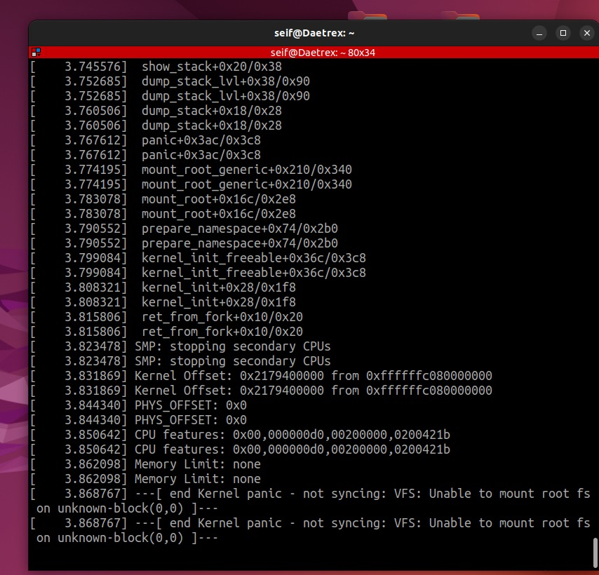

# 🛡️ Run Raspberry Pi 3B+ Aarch64 Kernel via U-Boot

This project demonstrates the process of booting a custom 64-bit Linux Kernel on physical **Raspberry Pi 3B+** hardware using **U-Boot**, specifically optimized for **Serial Console** debugging.

---

## 0. Output
> Successfully reached the **Kernel Panic** milestone, confirming the functional handover from U-Boot to the Linux Kernel via the Serial interface.
> 

---

## 1. Partition & Format USB Disk
The Raspberry Pi 3B+ firmware requires a specific partition structure to recognize the boot files:

* **Partition Table:** Must be **MBR (Master Boot Record)** / DOS.
* **Boot Flag:** The primary partition must be marked as **Active/Bootable** (`*`).
* **Format:** FAT32 (LBA).

```bash
# Example formatting via terminal
sudo mkfs.vfat -F 32 -n RPI_BOOT /dev/sda1
```

## 2. Prepare the FAT Partition
/path/to/BOOT/
├── bcm2837-rpi-3-b-plus.dtb  # Device Tree Binary
├── bootcode.bin              # First stage bootloader (GPU)
├── config.txt                # System configuration & UART clocks
├── fixup.dat                 # GPU memory fixer
├── Image                     # 64-bit Linux Kernel
├── start.elf                 # GPU Firmware
└── u-boot.bin                # Second stage bootloader

### Mandatory config.txt Configuration
```ini
enable_uart=1
dtoverlay=miniuart-bt
arm_64bit=1
kernel=u-boot.bin
```

## 3. Load & Run the Kernel
```bash
sudo picocom -b 115200 /dev/ttyUSB0
```

### Once **U-boot** runs:
```bash
# 1. Initialize USB hardware
usb start

# 2. Set bootargs for Serial Console
setenv bootargs "earlycon=bcm2835aux,0x3f215040 console=ttyS0,115200 8250.nr_uarts=1 ignore_loglevel root=/dev/none"

# 3. Load the Device Tree and Kernel Image into RAM
fatload usb 0:1 ${fdt_addr_r} bcm2837-rpi-3-b-plus.dtb
fatload usb 0:1 ${kernel_addr_r} Image

# 4. Boot the 64-bit image (The '-' indicates no ramdisk)
booti ${kernel_addr_r} - ${fdt_addr_r}
```