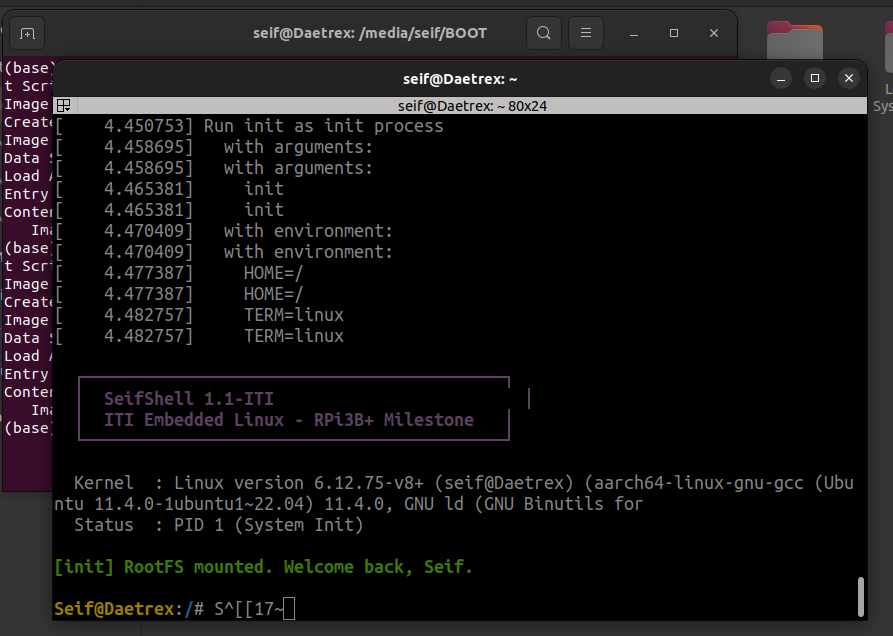

# Booting custom RootFS & SeifShell on RPi 3B+
This project documents the transition from a "Kernel Panic" state to a functional Linux environment by configuring a dual-partition USB drive, an EXT4 RootFS, and a statically compiled init process.

This project demonstrates the process of booting a custom 64-bit Linux Kernel on physical **Raspberry Pi 3B+** hardware using **U-Boot**, specifically optimized for **Serial Console** debugging.

---

## 0. Output
> Successfully bypassed the VFS: Unable to mount root fs error by implementing a 2-second rootdelay and mounting the secondary EXT4 partition.
> 

---

## 1. Partition & Format USB Disk
Partition	Type	Purpose	Label
Partition 1	FAT32	GPU Firmware, U-Boot, Kernel, DTB	BOOT
Partition 2	EXT4	Root Filesystem (RootFS) & /init	ROOTFS

### Formatting via Terminal (fdisk)
```bash
# 1. Create MBR Table ('o'), Part 1 (+256M, type 'c'), Part 2 (Remainder, type '83')
sudo fdisk /dev/sda 

# 2. Format the partitions
sudo mkfs.vfat -F 32 -n BOOT /dev/sda1
sudo mkfs.ext4 -L ROOTFS /dev/sda2
```

## 2. Prepare the RootFS (/dev/sda2)
Unlike the boot partition, the ROOTFS must contain your compiled binary at the absolute root.
```bash
# Compile SeifShell statically for Aarch64
aarch64-linux-gnu-gcc -static init.c -o init

# Copy to the second partition
sudo cp init /media/seif/ROOTFS/
```


## 3. Automation via boot.scr
To avoid typing manual commands in U-Boot, we use a compiled boot script.
**boot.cmd Configuration**
```bash
# Define memory addresses
setenv kernel_addr_r 0x01000000
setenv fdt_addr_r    0x02000000

# Initialize USB
usb start

# Kernel Arguments: Crucial for USB discovery
# root=/dev/sda2 -> Points to the EXT4 partition
# rootwait       -> Wait for USB hub to initialize
# rootdelay=2    -> Extra buffer for slow flash drives
setenv bootargs "console=ttyS0,115200 root=/dev/sda2 rw rootwait rootdelay=2 init=/init"

# Load and Boot
fatload usb 0:1 ${kernel_addr_r} Image
fatload usb 0:1 ${fdt_addr_r} bcm2837-rpi-3-b-plus.dtb
booti ${kernel_addr_r} - ${fdt_addr_r}
```

**Compile the Script**
```bash
mkimage -A arm64 -T script -C none -n "Boot Script" -d boot.cmd boot.scr
# Move boot.scr to the FAT32 partition
```


# Network Booting (NFS) & Remote RootFS
This stage documents the transition from local USB storage to a Network File System (NFS), allowing the Raspberry Pi 3B+ to mount its RootFS directly from a host laptop (Daetrex) over Ethernet.

## 0. Output
    Successfully achieved PID 1 (System Init) over a 100Mbps Ethernet link. Bypassed physical disk dependency by mounting **/srv/nfs/rootfs** via the **lan78xx** driver.

## 1. Host Side Setup (PC)
The host laptop acts as the File Server. We must configure the NFS kernel server to "export" the RootFS directory to the Pi's specific IP.

```bash
# 1. Install the NFS Server
sudo apt update && sudo apt install nfs-kernel-server

# 2. Prepare the directory (Ensure SeifShell /init is here)
sudo mkdir -p /srv/nfs/rootfs
sudo cp -r /path/to/your/compiled/rootfs/* /srv/nfs/rootfs/

# 3. Define the Export Rules
# rw: Read/Write access | no_root_squash: Allows Pi's root to act as root
echo "/srv/nfs/rootfs 192.168.2.2(rw,no_root_squash,no_subtree_check,sync)" | sudo tee -a /etc/exports

# 4. Refresh Exports
sudo exportfs -ra
sudo systemctl restart nfs-kernel-server
```

## 2. Host Networking (Static IP)
The Pi and Laptop must be on the same subnet before the Kernel mounts the RootFS.

```bash
# Assign static IP 192.168.2.1 to the Ethernet interface
sudo ip addr add 192.168.2.1/24 dev enp44s0
sudo ip link set enp44s0 up
```

## 3. Automation via Hybrid boot.scr
The **bootargs** are the most critical part of this stage. They instruct the Kernel to ignore the USB/SD and initialize the **eth0** interface using a static IP handshake.

## 4. TFTP Server Configuration (Daetrex)
The TFTP server is used as a fallback or primary source to load the Kernel (Image) and Device Tree **(.dtb)** directly into RAM from the laptop, eliminating the need to ever touch the USB drive's files again.

### Install & Configure TFTP

```bash
# 1. Install the TFTP HPA Server
sudo apt update && sudo apt install tftpd-hpa

# 2. Configure the service
# Edit /etc/default/tftpd-hpa
sudo nano /etc/default/tftpd-hpa
```
### Ensure your config file looks like this:
```
TFTP_USERNAME="tftp"
TFTP_DIRECTORY="/srv/tftp"
TFTP_ADDRESS=":69"
TFTP_OPTIONS="--secure --create"
```

### Prepare the Boot Files
The TFTP server looks in /srv/tftp by default. You must place your compiled kernel and device tree here.

```bash
# 1. Create the directory and set permissions
sudo mkdir -p /srv/nfs/tftp
sudo chown -R tftp:tftp /srv/tftp
sudo chmod -R 777 /srv/tftp

# 2. Copy the boot files
sudo cp /media/seif/BOOT/Image /srv/tftp/
sudo cp /media/seif/BOOT/bcm2837-rpi-3-b-plus.dtb /srv/tftp/

# 3. Restart the service to apply changes
sudo systemctl restart tftpd-hpa
```

### Verification from the Host
```bash
# Install a tftp client
sudo apt install tftp-hpa

# Try to 'get' the Image from yourself
tftp 192.168.2.1 -c get Image
ls -l Image
# If the file appears in your current folder, the server is live.
```